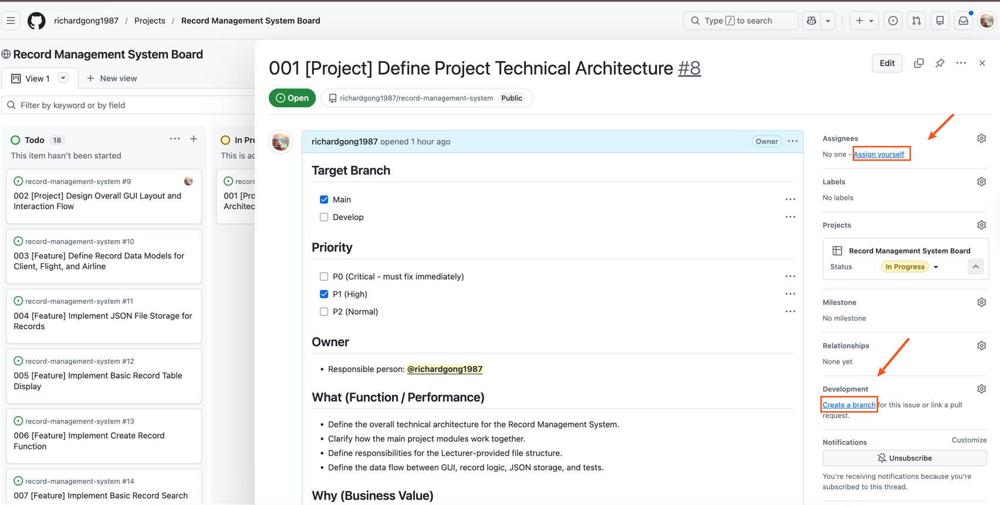
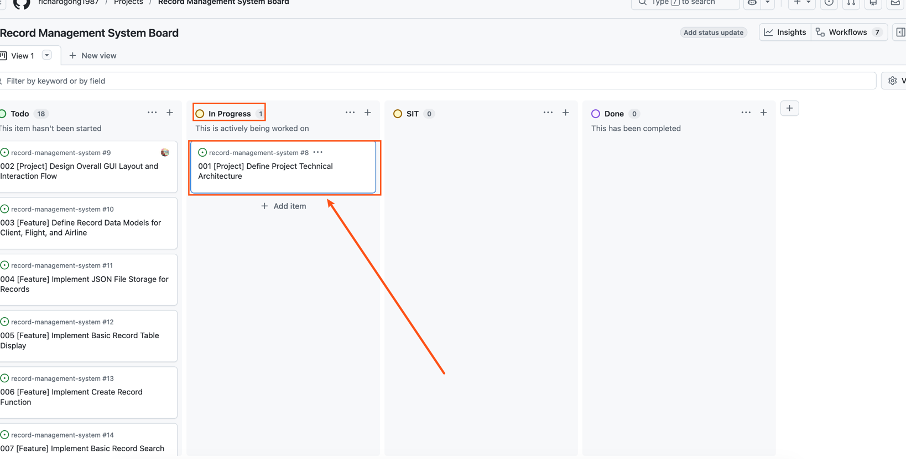
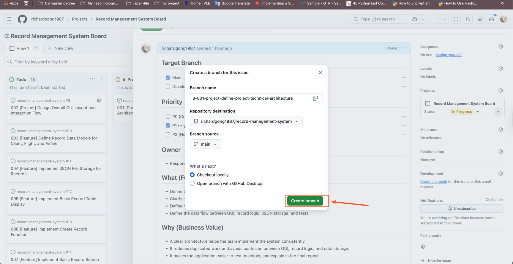

# Developer Task Workflow Guide

This guide explains how each teammate picks up a task, creates a branch, completes the work, requests review, and closes the task. It is written for teammates who are new to GitHub — every step is described in plain language.

We work as equals on this project. There is no "lead" or "manager"; whoever picks a task is responsible for driving it through to merge. The same teammate who today happens to hold repository admin (currently `richardgong1987`) plays no special role inside this workflow — every PR is reviewed by another teammate and merged by the author.

## Useful links

- Repository: <https://github.com/richardgong1987/record-management-system>
- Kanban board: <https://github.com/users/richardgong1987/projects/1/views/1>
- [Joining the project](joining-the-project.md)
- [Git commit conventions](commit-conventions.md)

## 1. Goals of the workflow

- Every task has a clear owner.
- Every task is tracked by a GitHub Issue.
- Every task is developed on a **separate branch** — never directly on `main`.
- Every completed task is reviewed through a **Pull Request** before merging.
- The Kanban board status reflects reality at all times.
- The `main` branch always builds and runs.

## 2. Key terms

| Term | Meaning |
| --- | --- |
| Issue | A task or ticket on GitHub describing what needs to be done |
| Assignee | The teammate responsible for completing the Issue |
| Branch | A separate working copy of the code for one task |
| Pull Request (PR) | A request to merge completed work into `main` |
| Reviewer | A teammate who checks the PR before it is merged |
| Kanban board | The GitHub Projects board used to track task status |
| SIT | System Integration Testing — review/testing stage after a PR is opened |
| Done | The task has been reviewed, merged, and closed |

## 3. Kanban board columns

Status flow:

```
Todo → In Progress → SIT → Done
```

| Column | Meaning |
| --- | --- |
| Todo | Defined and ready to be picked up. Not yet started. |
| In Progress | A teammate is actively working on it (a branch exists, no PR yet). |
| SIT | A Pull Request is open and is being reviewed and tested. |
| Done | Reviewed, merged into `main`, and the Issue is closed. |

> **One-time setup:** the board currently has only **Todo / In Progress / Done**. Add a **SIT** column once via **+ (rightmost) → New column → name it `SIT`** so the workflow below has somewhere to park PRs that are under review.

## 4. The workflow, step by step

### Step 1 — Pick a task

Open the [Kanban board](https://github.com/users/richardgong1987/projects/1/views/1) and find a card in **Todo** that has **no assignee**. Click the card to open the Issue and read the description carefully (Target Branch, Priority, What/Why). If anything is unclear, leave a comment on the Issue or raise it in the group chat before claiming it.

### Step 2 — Assign the Issue to yourself

In the Issue's right-hand sidebar, find **Assignees** and click **Assign yourself**.



This signals to the rest of the team that the task is taken — no one else should pick it up.

### Step 3 — Move the card to "In Progress"

On the Kanban board, drag the card from **Todo** to **In Progress**.



> **Rule of thumb:** the board should mirror reality. If you stop work for the day, that is fine — the card stays in **In Progress**. If you decide to abandon the task or hand it off, move the card back to **Todo** and unassign yourself so someone else can pick it up.

### Step 4 — Create a branch from the Issue

GitHub can create a branch directly from the Issue, which automatically links the branch (and any future PR) to the Issue. In the Issue's right-hand sidebar, find **Development** and click **Create a branch**.

A dialog appears. Keep the suggested branch name — it already includes the Issue number and title (for example `8-001-project-define-project-technical-architecture`) — make sure **Branch source** is `main`, then click **Create branch**.



> **Why this matters:** branches created this way are linked to the Issue. When you later open a PR from the branch, GitHub knows which Issue it relates to and the Kanban automation can move cards for you.

### Step 5 — Check out the branch locally

In a terminal:

```bash
git fetch origin
git checkout <branch-name>
# example: git checkout 8-001-project-define-project-technical-architecture
```

If `main` has moved on since you created the branch, bring your branch up to date:

```bash
git fetch origin
git rebase origin/main
```

### Step 6 — Develop and commit

Make your code changes. Commit in small, focused chunks rather than one giant commit at the end — small commits are easier to review and easier to revert.

**Every commit message must follow the [Git commit conventions](commit-conventions.md).** Quick reminder of the header format:

```
<type>(<scope>): <subject>
```

Example: `feat(gui): add client record creation form`

### Step 7 — Push your branch

```bash
git push -u origin <branch-name>
```

The `-u` flag sets the remote tracking branch on your first push. After that `git push` on its own is enough.

### Step 8 — Open a Pull Request

On GitHub, go to the **Pull requests** tab and click **New pull request** — or use the green **Compare & pull request** banner that appears at the top of the repository right after you push.

- **Base:** `main`
- **Compare:** your branch

Write a short PR description that:

1. Says **what** the PR changes in one or two sentences.
2. Says **why** the change is needed.
3. Includes the line `Closes #<issue-number>` so the Issue auto-closes when the PR is merged.
4. Calls out anything the reviewer should pay extra attention to.

**Example PR description:**

```
Adds the client record creation form.

The form validates required fields client-side before persisting via the
data layer.

Closes #8
```

### Step 9 — Link the PR to the Issue

You have two ways to do this; doing **either** is enough, but doing both makes the link extra clear.

- **(Recommended)** Put `Closes #<issue-number>` (or `Fixes #<issue-number>`) anywhere in the PR description. GitHub auto-closes the Issue when the PR is merged.
- In the PR's right-hand sidebar, under **Development**, click the gear and link the related Issue.

If you created the branch from the Issue (Step 4), the link already exists — but `Closes #N` is still recommended because it triggers the auto-close on merge.

### Step 10 — Request a reviewer

In the PR's right-hand sidebar, click the gear next to **Reviewers** and pick at least **one** other teammate. Mention them in the group chat so they know a PR is waiting.

Reviewer etiquette:

- **Never review your own PR** — always pick a different teammate.
- Spread the review load — try not to always pick the same person.
- If a PR is urgent because it unblocks someone else, say so when you request review.

### Step 11 — Move the card to "SIT"

Drag the Kanban card from **In Progress** to **SIT**. The card stays in **SIT** while the PR is under review.

### Step 12 — Address review feedback

The reviewer leaves comments on the PR. Push follow-up commits to the **same branch** — the PR updates automatically. Reply to each comment with what you changed (or why you disagree) so the conversation is easy to follow.

When the reviewer is happy, they click **Approve**.

### Step 13 — Merge

Once the PR is approved, **the PR author merges it** (don't merge someone else's PR unless they have asked you to).

- Use **Squash and merge** for small PRs (a single feature or fix). The squashed commit message should still follow the [commit conventions](commit-conventions.md).
- Use **Create a merge commit** only if the branch genuinely contains multiple meaningful commits worth keeping.

After merging, click **Delete branch** to keep the repository tidy.

### Step 14 — Move the card to "Done"

Because the PR description contained `Closes #<issue-number>`, merging the PR closes the Issue automatically and (depending on the board automation rules) moves the card to **Done**. If the card does not move on its own, drag it manually.

## 5. Avoiding conflicts with teammates

A few small habits prevent painful merge conflicts:

- **One branch per Issue.** Don't share branches between teammates.
- **Keep branches short-lived.** Aim to merge within a few days. Long-lived branches drift from `main` and become harder to merge.
- **Pull `main` regularly.** Before you start, and at least once a day while a branch is open:
  ```bash
  git fetch origin
  git rebase origin/main
  # or, if rebasing feels risky:  git merge origin/main
  ```
- **Talk before touching shared files.** If two teammates need to edit the same module (e.g., something under `src/data/`), coordinate in the group chat first.
- **Never push directly to `main`.** All changes go through a PR.
- **Never force-push to `main`.** Force-pushing your own feature branch is fine; force-pushing `main` rewrites history for everyone.

## 6. Quick checklist

When you finish a task, double-check:

- [ ] The Issue is assigned to you.
- [ ] The branch was created from the Issue (so it is linked).
- [ ] Every commit message follows the [commit conventions](commit-conventions.md).
- [ ] The branch is rebased on (or merged with) the latest `main`.
- [ ] The PR description includes `Closes #<issue-number>`.
- [ ] At least one reviewer has been requested (and notified in the group chat).
- [ ] The Kanban card is in **SIT** while the PR is under review.
- [ ] After merge: the branch is deleted, the Issue is closed, and the card is in **Done**.
