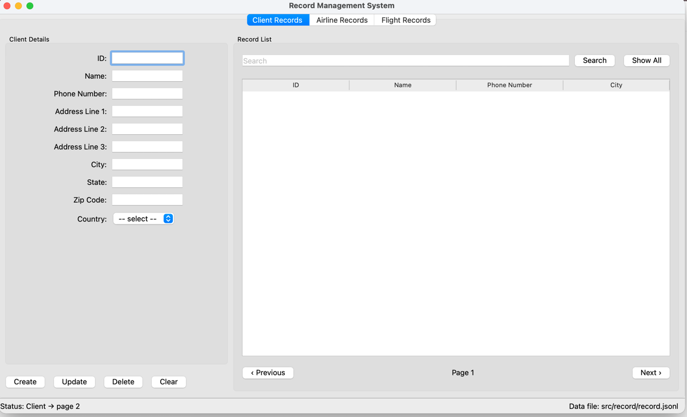

# How the GUI is put together

A short tour through `src/gui/` for teammates picking up the code. The formal design with the §15.2 sections lives in [`docs/design/gui-layout.md`](../design/gui-layout.md); this page covers the same shape but focuses on how to find your way around and why we landed on it.

---

## What the window looks like

`python src/main.py` opens this — the layout we settled on as Option 3 in the GUI design discussion:



Three tabs along the top, one per record type. Inside each tab: a form on the left for editing one record, a record list on the right for browsing. A two-cell status bar along the bottom.

---

## Building blocks

The window is four reusable pieces plugged together:

| Piece | What it is | Where it lives |
| --- | --- | --- |
| `MainWindow` | The shell that holds everything | `src/gui/main_window.py` |
| `TabView` | One tab — a form on the left + a list on the right | `src/gui/tab/` |
| `RecordListView` | Search box + table + Previous / Next pager | `src/gui/record_list/` |
| `StatusBarView` | Bottom bar with status text + data-file path | `src/gui/status_bar/` |

Plus one form per record type (the only thing that actually differs between tabs):

- `src/gui/client/`  — `ClientFormView` + `ClientFormController` + field labels
- `src/gui/airline/` — `AirlineFormView`  + …
- `src/gui/flight/`  — `FlightFormView`   + …

All three tabs share the same `TabView`, the same `RecordListView`, and the same `StatusBarView`. Only the form differs.

---

## Why this shape

A few decisions worth knowing the reasoning behind:

- **Tabs, not a record-type dropdown.** Tabs make the active record type obvious, and each tab keeps its own state — the form you typed in stays put when you switch away. The dropdown idea was rejected during the design discussion because it added a click for what is the most common navigation action.
- **Form on the left, list on the right.** You pick or find a record on the right, you edit it on the left. Stretch ratio 1 : 2 (the list is twice as wide as the form) because the list usually has more to show.
- **One shared `TabView` + `TabController`** instead of three near-identical per-type classes. Three copies of the same code is a refactor target under our coding standards, so we collapsed it into one.
- **One status bar with two cells.** Left cell shows what just happened (`Status: Create Client {...}`). Right cell shows where the data lives (`Data file: src/data/record.jsonl`). Useful even before persistence is wired in.

---

## View vs. controller — the split inside each folder

Each widget folder (`client/`, `record_list/`, …) contains two files:

- `view.py` — builds the widgets (text boxes, buttons, tables). Knows nothing about what happens when you click.
- `controller.py` — wires up the clicks. Reads the view's state on click and emits a Qt signal describing what the user wants. Knows nothing about how the widgets are arranged.

The split keeps each file small and lets one side change without disturbing the other. If the form layout needs rearranging, that's `view.py`. If we change what `Create` does, that's `controller.py`.

A signal, in Qt terms, is just a typed event — when something happens, the widget emits a signal, and any code that has connected to it runs. That's the only pattern you need to recognise to read the rest of the code.

---

## What happens when you click a button

The user types into the Client form and clicks **Create**:

```
1.  User clicks the [Create] button in ClientFormView
        ↓ (Qt's built-in QPushButton.clicked signal)
2.  ClientFormController._on_create() runs
        ↓ reads every field via ClientFormView.read_payload()
3.  ClientFormController emits create_requested(dict)            ← raw intent
        ↓
4.  TabController hears it and re-emits with a "Client" tag:
        create_requested("Client", dict)                         ← tagged intent
        ↓
5.  MainWindow._on_create("Client", dict) runs
        ↓
6.  Status bar shows: "Status: Create Client {name: ..., ...}"
```

Steps 1–3 happen inside `client/`. Step 4 is the shared `tab/` folder. Steps 5–6 are the shell (`main_window.py`).

The same path is followed for Update / Delete / Search / Show All / Previous / Next — only the signal name and payload differ. The consistency is deliberate: once you've read one, you've read all of them.

When the persistence layer lands later, the slot in `MainWindow` will hand the payload to a parser → validator → service → repository pipeline instead of just writing to the status bar. None of the GUI code changes; only that one slot grows.

---

## Where to look when you want to change something

| To change | Edit |
| --- | --- |
| Window title or size | `src/gui/main_window.py` |
| Which tabs exist / their labels | `src/gui/main_window.py` (`_build_*_tab`) |
| Field list shown for **Client** | `src/gui/client/types.py` (`CLIENT_TEXT_FIELDS`) |
| Field list shown for Airline / Flight | `src/gui/airline/types.py` / `flight/types.py` |
| Country options in the Client combo | `src/gui/client/types.py` (`COUNTRIES`) |
| Columns shown in the table for a tab | `src/gui/main_window.py` (`*_COLUMNS` constants) |
| Search / Show All / Previous / Next buttons | `src/gui/record_list/view.py` |
| What Create / Update / Delete / Clear actually do | `src/gui/<type>/controller.py` |
| Status-bar text or data-file label | `src/gui/status_bar/view.py` |

---

## Adding things

### A new field on the Client form

Append the field name to `CLIENT_TEXT_FIELDS` in `src/gui/client/types.py`. The form rebuilds itself from that list, and `read_payload()` picks the new field up automatically. When persistence lands, the parser and the design doc need updating too.

### A new column on the Airline list

Append the column to `AIRLINE_COLUMNS` in `src/gui/main_window.py`. The table reads its columns from that list.

### A new record type, say "Hotel"

1. Copy `src/gui/airline/` to `src/gui/hotel/` (Airline is the simplest of the three to start from).
2. Rename `AirlineFormView` → `HotelFormView` and `AirlineFormController` → `HotelFormController` in the new files.
3. In `src/gui/main_window.py`: add a `HOTEL_COLUMNS` constant and a `_build_hotel_tab` method mirroring `_build_airline_tab`, then append the new tab to the list returned in `__init__`.

The shared `TabView`, `RecordListView`, and `TabController` need no changes.

---

## Suggested first read

Run `python src/main.py`, then open `src/gui/main_window.py` next to the window and match every visible widget to the line that built it. Once that mapping is clear, the rest of `src/gui/` reads quickly.

For the formal version with edge cases and the error-handling strategy: [`docs/design/gui-layout.md`](../design/gui-layout.md). For the coding standards we follow: [`CLAUDE.md`](../../CLAUDE.md) at the repo root.
