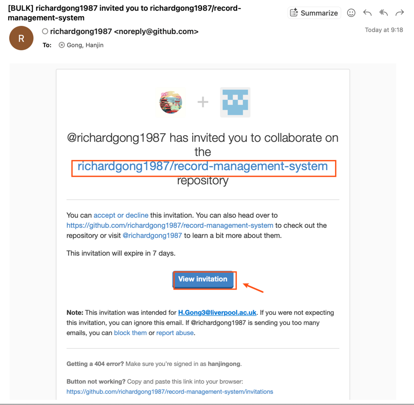

# Joining the Project

This document describes how a new classmate joins the **Record Management System** project on GitHub. We work as a team of equal collaborators — there is no hierarchy; one of us simply happens to currently hold the repository's admin permission to send invitations.

## Useful links

- Repository: <https://github.com/richardgong1987/record-management-system>
- Kanban board: <https://github.com/users/richardgong1987/projects/1>

## Prerequisites

The joining teammate needs a [GitHub](https://github.com/) account, and shares their **GitHub username** (and the email associated with that account, if known) in our group chat.

## Step 1 — Send the invitation

A teammate with admin access on the repo (currently `richardgong1987`) opens the repository on GitHub and adds the new collaborator:

**Settings → Collaborators → Add people →** enter the new teammate's GitHub username **→ Add to this repository**.

GitHub then sends an invitation email to the address on the invitee's account.

## Step 2 — Accept the invitation

The joining teammate:

1. Opens the invitation email in the inbox of the email tied to their GitHub account.
2. Clicks **View invitation** in the email.
3. On the GitHub page that opens, clicks **Accept invitation**.

Once accepted, they join the project with:

- Push access to the repository (so they can develop and open pull requests alongside everyone else).
- Access to the shared [Kanban board](https://github.com/users/richardgong1987/projects/1).

## Troubleshooting

- **Invitation email never arrived.** Check spam, then ask whoever sent it to copy the invitation URL from **Settings → Collaborators** and share it directly in the group chat.
- **Invitation expired.** Invitations expire after 7 days. Ask for a fresh one in the group chat.
- **Can't see the Kanban board.** Access is granted automatically once the repository invitation is accepted. If it still does not appear, sign out and back in.
