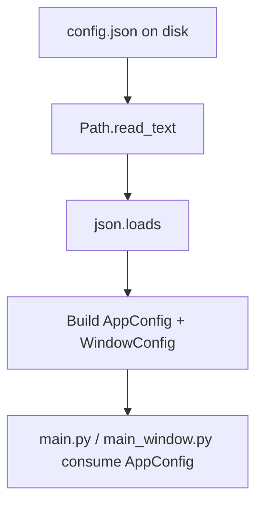

# Application Configuration

> Scope: centralise hard-coded runtime values (record file location, icon path, app title, window sizing) into a single JSON file, loaded once at startup. No runtime mutation, no per-user override yet.

## 1. Problem Description

- **Problem**: paths and labels (`DATA_FILE_PATH`, `APP_ICON_PATH`, `APP_TITLE`, window sizing constants) are scattered across `src/main.py` and `src/gui/main_window.py`. A teammate who wants to change the data file location or rename the app must hunt across modules. The brief's eventual deliverable is a packaged app; configuration belongs outside code.
- **Expected input**: `src/conf/config.json`, a static file that ships with the application.
- **Expected output**: an immutable `AppConfig` dataclass exposed by `src/conf/loader.py`, with resolved absolute paths and typed sub-sections.

## 2. Data Flow

```
config.json  →  Reader (Path.read_text)  →  Parser (json.loads)  →  Loader (build AppConfig)  →  consumed by main.py / main_window.py
```

This matches the canonical pipeline of the project: read external bytes, parse, build a typed object. No validation step (the file is shipped with the code and only changed by the team), no repository.

## 3. Mermaid Flow Diagram



## 4. Module Design

### 4.1 File map

| File                  | Role                                                                    |
| --------------------- | ----------------------------------------------------------------------- |
| `src/conf/config.json` | The single source of runtime configuration. Paths are relative to `src/`. |
| `src/conf/loader.py`  | `load_config() -> AppConfig`; resolves paths against `src/`.            |

### 4.2 Schema

```json
{
  "app": {
    "name": "Record Management System",
    "icon_path": "icons/favorite.png"
  },
  "data": {
    "record_file": "data/record.jsonl"
  },
  "window": {
    "preferred_width_ratio": 0.85,
    "preferred_height_ratio": 0.80,
    "max_width": 1600,
    "max_height": 1000,
    "min_width": 960,
    "min_height": 620,
    "fallback_width": 1200,
    "fallback_height": 720,
    "screen_padding": 40
  }
}
```

Path values are interpreted **relative to `src/`** so the same config works whether the app is launched from the repo root, a packaged bundle, or a test sandbox.

### 4.3 Loader API

| Symbol                     | Responsibility                                                                                  |
| -------------------------- | ----------------------------------------------------------------------------------------------- |
| `WindowConfig` (dataclass) | Frozen container for window sizing values (8 fields).                                            |
| `AppConfig` (dataclass)    | Frozen container: `name: str`, `icon_path: Path`, `record_file: Path`, `window: WindowConfig`.   |
| `load_config() -> AppConfig` | Read `config.json` once, parse, return `AppConfig` with absolute paths.                        |

### 4.4 Dependency direction

- `conf.loader` depends on nothing in `gui/` or `record/`. It is below them in the dependency graph.
- `main.py` and `gui.main_window` depend on `conf.loader`, not the reverse.

## 5. Edge Cases

- **`config.json` missing**: `Path.read_text` raises `FileNotFoundError`. Propagated unwrapped — the app cannot start without configuration, and a swallowed default would hide a packaging bug. Fail fast.
- **Malformed JSON**: `json.JSONDecodeError` propagates. Same reasoning.
- **Missing required key** (e.g. `app.name`): `KeyError` propagates. The schema is authoritative; future schema migration belongs in a separate change.
- **Relative path escapes `src/`** (e.g. `"../etc/passwd"`): `Path.resolve()` produces an absolute path; the consumer (`load_records`, `QIcon`) decides whether to honour it. No sandboxing — we trust the file we ship.
- **Tests overriding paths**: tests already monkeypatch `mw.DATA_FILE_PATH`. Keeping `DATA_FILE_PATH` as a module-level constant in `main_window.py` (initialised from the loader at import time) preserves that interface.

## 6. Error Handling Strategy

- **Detection**: at the loader layer. Read / parse / key lookup all raise.
- **Propagation**: exceptions bubble to `main()`. A missing or broken config crashes the app at startup with a clear stack trace — that is the right behaviour for a static config shipped with the code.
- **User feedback**: none at this layer. The future config-reload feature (out of scope) will route user-facing errors through `StatusBarView`.

## 7. Implementation Notes

- `loader.py` resolves paths against `_SRC_ROOT = Path(__file__).resolve().parents[1]` (which is `src/`).
- `load_config()` is called twice in the current bootstrap (once in `main.py` for icon + title, once in `main_window.py` for paths + window sizing). The JSON file is ~20 keys; the double read is intentional — caching would couple the two modules.
- Schema is fixed at v1; no version field yet. Add one when the first breaking change lands.
