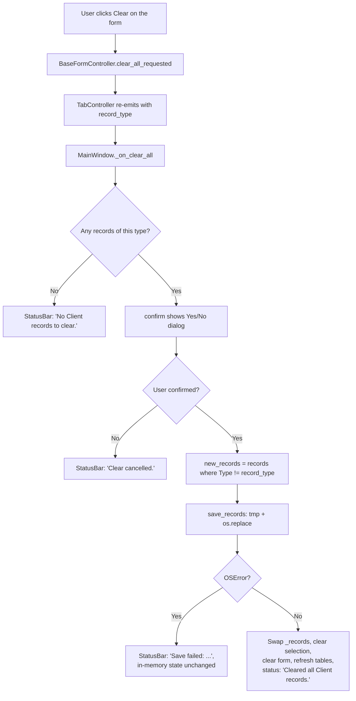

# How clearing all records of one type works

Design doc and tour for the **Clear** button, which empties every record of the currently-active tab's type. Covers the §15.2 sections (problem, data flow, mermaid diagram, module design, edge cases, error handling) and a walkthrough for teammates picking up the code.

Companion to [`delete-record.md`](delete-record.md) — read that first if you haven't, because Clear is the bulk-action sibling of single-row Delete and reuses the same confirmation + atomic-write discipline.

---

## What it does

Click **Clear** on the Client tab → a confirmation dialog asks "Delete ALL Client records? This cannot be undone." → confirm:

1. every record of that type is dropped from the in-memory list,
2. the JSONL file is rewritten atomically with the survivors of the other types,
3. the table on the right of the current tab becomes empty,
4. the form on the left is cleared and the selection for that tab is forgotten.

If the user declines the confirmation, nothing changes. If the tab has no records of that type to begin with, the status bar says so and the confirmation dialog is **not** shown — there is no point asking "are you sure?" about an empty action. If the disk write fails, the in-memory list is untouched and the status bar shows the reason.

The button label stays "Clear" so the existing UI is undisturbed, but the action is now destructive on data rather than purely cosmetic on the form. The confirmation dialog is what keeps that safe.

---

## Problem description

- **Problem**: when the user wants to start over for a record type — wipe a test dataset, clear all flights for a cancelled itinerary, etc. — they should not have to click Delete dozens of times in a row. Clear gives them one click + one confirmation to empty the active tab's data.
- **Expected input**: a click on the Clear button while a tab is active. No row selection is required and no form payload is consulted.
- **Expected output**: every record whose `Type` equals the active tab's `record_type` is removed from `record.jsonl`; all records of other types are untouched; the active tab's table becomes empty; the form on that tab is cleared and the selection is reset to `None`.

---

## Data Flow

Clear has no parsing or validation step — the operation removes records by type rather than producing one — so the pipeline degenerates to **Reader → Confirmer → Repository**, the same shape as Delete:

```
BaseFormView.clear_btn.clicked       → Reader      (intent to clear all; no payload, no row)
gui.common.dialogs.confirm           → Confirmer   (modal Yes/No)
MainWindow._on_clear_all             → Orchestrator (filter out the type, save, swap state)
save_records                         → Repository  (atomic JSONL write)
```

`confirm(parent, title, body)` lives in `src/gui/common/dialogs.py` and is shared with Delete — both modal dialogs default to **No**, and a single `monkeypatch.setattr(gui.main_window, "confirm", …)` substitutes both flows for testing.

---

## Mermaid Flow Diagram



---

## Module Design

The dependency arrow still points one way — GUI → record — and `record.*` has zero `from gui.*` imports.

### GUI side (Reader + Confirmer + Orchestrator)

| Module | Responsibility | Input | Output |
| --- | --- | --- | --- |
| `gui.common.BaseFormController.clear_all_requested` | Replace the previous "clear the form widgets" wiring with an emit so the orchestrator can act on the intent. | clear-button click | `clear_all_requested()` Qt signal |
| `gui.tab.TabController.clear_all_requested` | Tag the intent with this tab's `record_type` and re-emit. | `clear_all_requested()` | `clear_all_requested(str)` Qt signal |
| `gui.common.dialogs.confirm` | Modal Yes/No around an arbitrary title + body. Defaults to **No** so accidental Enter never deletes. Shared with `_on_delete`. | `parent: QWidget`, `title: str`, `body: str` | `bool` (True = user confirmed) |
| `gui.main_window.MainWindow._on_clear_all` | Orchestrator: nothing-to-clear short-circuit → confirm → filter records → save → swap state → reset form/selection → status. | `record_type: str` | side-effects: in-memory state, file, form, table, status message |

### Data side — reused unchanged

| Module | Responsibility |
| --- | --- |
| `record.repository.save_records` | Atomic JSONL write — write `record.jsonl.tmp` then `os.replace`. |

No data-layer code changes are required.

---

## Edge Cases

| Case | Handling |
| --- | --- |
| Active tab has no records of its type | Status bar: `"No <Type> records to clear."`; **no** confirmation dialog (it's a no-op, not a destructive action). |
| User opens the confirmation and clicks **No** (or closes the dialog) | Status bar: `"Clear cancelled."`; in-memory list and file untouched. |
| User confirms while records of other types exist | Other-type records are preserved; only the active tab's type is filtered out. |
| User confirms with the entire store containing only the active type | `new_records == []`; `save_records` writes an empty JSONL file. |
| User had a row selected for that type before clicking Clear | After a successful clear the selection drops to `None` and the form is emptied, so the next Update / Delete on this tab will show the standard "Select a record …" prompt rather than silently target a ghost record. |
| Disk-write failure during `save_records` (`OSError` / `PermissionError`) | `self._records` is **not** reassigned; the previously visible rows stay on screen. Status bar shows `"Save failed: …"`. |
| User has a row selected on a **different** tab when clicking Clear | That tab's selection is **not** touched. Only the active tab's selection is reset, matching what the user just affected. |

---

## Error Handling Strategy

- **Where errors are detected**:
  - nothing-to-clear is observed by `_records_for_type(record_type)` being empty.
  - declined confirmation is observed via the `bool` return of `confirm`.
  - persistence errors (`OSError`, including `PermissionError`) are raised by `save_records`.
- **How they are propagated**:
  - the data layer raises; it never logs, never returns error codes, never silently corrects.
  - the orchestrator (`MainWindow._on_clear_all`) is the only place that catches them.
- **How they are handled**:
  - empty source → status bar prompt; function returns before the dialog even opens.
  - declined confirmation → status bar `"Clear cancelled."`; function returns before touching data.
  - persistence failure → status bar `"Save failed: <reason>"`. The new survivor list is built as a separate object and `self._records = new_records` is the **last** mutation, executed only after the save succeeds. Same rollback discipline as Delete and Update.
- **What is NOT handled today** (known gaps):
  - There is no "undo last clear" — once the save commits, the records are gone.
  - Concurrent edits from another process are not considered (single-user desktop tool).

---

## Why this shape

- **Repurpose the existing Clear button rather than add a new one.** The form-clear behaviour was a convenience action that the user can always replicate by clicking a row in the table (which re-populates the form) or simply by editing fields. The destructive-bulk variant is the more valuable use of that button slot, and the confirmation dialog plus default-No button keep it safe.
- **No row selection required.** Clear is per-tab, not per-row. Demanding a selection would be a UX trap: "I clicked Clear, why doesn't it clear?" Forcing the user to first click a row before clicking Clear would be worse than today.
- **No confirmation when there is nothing to clear.** Asking "are you sure you want to delete 0 records?" trains the user to dismiss confirmations on autopilot. The early-return preserves the dialog's signal value.
- **Confirmation lives behind a shared seam.** `confirm(parent, title, body)` in `src/gui/common/dialogs.py` is the same helper Delete uses. Tests substitute it with a one-line `monkeypatch.setattr(gui.main_window, "confirm", lambda *_a, **_k: True)` and get full control over both flows without touching `QMessageBox` internals.
- **Filter, then save, then swap.** Mirrors the create / update / delete rollback discipline: in-memory state only moves after persistence succeeds.
- **Clear the form and the selection on success.** Whatever was on screen for this tab is meaningless once the data is gone. Resetting both prevents the user from re-creating or re-editing a record that no longer exists.

---

## What happens when you click Clear

```
1. User clicks [Clear] in ClientFormView
       ↓
2. BaseFormController emits clear_all_requested()
       ↓
3. TabController re-emits clear_all_requested("Client")
       ↓
4. MainWindow._on_clear_all("Client"):
       a. if not self._records_for_type("Client"):
              status "No Client records to clear.", return
       b. if not confirm(self, "Confirm clear all",
                         "Delete ALL Client records? This cannot be undone."):
              status "Clear cancelled.", return
       c. new_records = [r for r in self._records if r["Type"] != "Client"]
       d. save_records(DATA_FILE_PATH, new_records)              ← atomic write
       e. self._records = new_records                            ← only AFTER save succeeds
       f. self._selected_record_by_type["Client"] = None
       g. tab.view.form.clear()
       h. self._refresh_all_tables()
       i. status bar: "Cleared all Client records."
```

If 4d raises `OSError`, the orchestrator catches it, shows `"Save failed: …"`, and skips 4e–4i — `self._records` is never reassigned, so the in-memory list stays consistent with the on-disk file.

---

## Where to look when you want to change something

| To change | Edit |
| --- | --- |
| The label or position of the Clear button | `src/gui/common/base_form_view.py` (`_build_crud_row`) |
| The text of the confirmation dialog | `src/gui/main_window.py` (`_on_clear_all`, the `body` literal) |
| Whether confirmation is required at all | `src/gui/main_window.py` (`_on_clear_all`, drop the `confirm(...)` branch) |
| Confirmation dialog defaults (default button, button labels) | `src/gui/common/dialogs.py` (`confirm`) |
| Behaviour after a successful clear (form clear, selection reset) | `src/gui/main_window.py` (`_on_clear_all`, tail of the function) |
| How records are persisted (JSONL today) | `src/record/repository.py` (shared with create/update/delete) |

---

## Suggested first read

Open `src/gui/main_window.py` and read `_on_clear_all` top to bottom — nine short steps and you have the whole feature. The dialog itself is a one-function file at `src/gui/common/dialogs.py`. Everything else (atomic save, table refresh) is shared with delete / update / create and is already documented in their design docs.