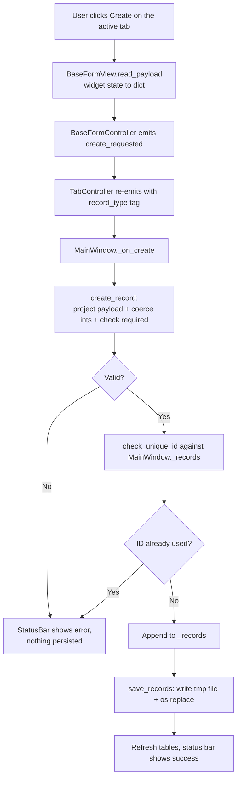

# How creating a record works

Design doc and tour for the create-record flow. Covers the §15.2 sections (problem, data flow, mermaid diagram, module design, edge cases, error handling) and a friendly walkthrough for teammates picking up the code.

---

## What it does

Fill in the Client / Airline / Flight form, click **Create**, and the new record:

1. is checked for missing fields and bad data,
2. is rejected if its `ID` clashes with an existing record of the same type,
3. is added to the in-memory list,
4. is saved to `src/data/record.jsonl`,
5. shows up in the table on the right.

If anything fails, the status bar at the bottom tells you why and nothing is written.

---

## Data Flow

The pipeline follows the canonical CLAUDE.md §9 shape: **Reader → Parser → Validator → Service → Repository**. Mapped to the actual code:

```
BaseFormView.read_payload           → Reader     (widget state → dict[str, str])
_project_payload + _coerce_integers → Parser     (dict[str, str] → typed record dict)
check_required + check_unique_id    → Validator  (raises RecordValidationError)
create_record                       → Service    (composes parser + validator)
save_records                        → Repository (atomic JSONL write)
```

The parser steps live as private helpers inside `service.py` rather than a separate `parser.py` — the surface is two short functions, so a fourth file would be ceremony. If parsing grows (date parsing, currency, etc.) we'll extract.

---

## Mermaid Flow Diagram



---

## Module Design

Each piece below has one job. The dependency arrow only points one way — GUI → data, never the reverse.

### GUI side (Reader + glue)

| Module | Responsibility | Input | Output |
| --- | --- | --- | --- |
| `gui.common.BaseFormView.read_payload` | Read every form widget into a flat `dict[str, str]`. | user-typed widget state | `dict[str, str]` |
| `gui.common.BaseFormController._on_create` | On Create-button click, emit `create_requested(payload)`. | view, button signal | `create_requested(dict)` Qt signal |
| `gui.tab.TabController` | Tag the raw intent with this tab's `record_type` and re-emit. | `create_requested(dict)` | `create_requested(str, dict)` Qt signal |
| `gui.main_window.MainWindow._on_create` | Orchestrator: validate → uniqueness → append → save → refresh → status. | `record_type: str`, `payload: dict` | side-effects: in-memory state, refreshed table, status message |

### Data side (Parser + Validator + Service + Repository)

| Module | Responsibility | Input | Output |
| --- | --- | --- | --- |
| `record.schema` | Canonical field tuples per record type (verbatim from the brief). | — | `ALLOWED_FIELDS`, `INTEGER_FIELDS`, `CLIENT_FIELDS`, `AIRLINE_FIELDS`, `FLIGHT_FIELDS` |
| `record.validator.check_required` | Raise if any required field is empty / `None` / `"-- select --"`. | `record_type: str`, `record: dict` | `None` or raises `RecordValidationError` |
| `record.validator.check_unique_id` | For Client / Airline, raise if `ID` already exists for the same `Type`. Flight is a no-op. | `record: dict`, `existing: list[dict]` | `None` or raises `RecordValidationError` |
| `record.service.create_record` | Compose parser + validator: project payload to allowed fields, coerce IDs to int, run `check_required`. | `record_type: str`, `payload: dict` | typed `record: dict` or raises |
| `record.repository.save_records` | Atomic JSONL write — write `record.jsonl.tmp` then `os.replace`. | `path: Path`, `records: list[dict]` | `None` (file written) |
| `record.repository.load_records` | Read the JSONL store on startup; `[]` if the file doesn't exist. | `path: Path` | `list[dict]` |

### Field schema (brief verbatim)

Defined in `record.schema`. `Type` is added by the service from the `record_type` argument and isn't in the field tuples.

| Record type | Fields (in order) |
| --- | --- |
| Client | `ID`, `Name`, `Address Line 1`, `Address Line 2`, `Address Line 3`, `City`, `State`, `Zip Code`, `Country`, `Phone Number` |
| Airline | `ID`, `Company Name` |
| Flight | `Client_ID`, `Airline_ID`, `Date`, `Start City`, `End City` |

Required fields per type live in `record.validator.REQUIRED_FIELDS`. Address Lines 2–3, State, and Zip Code are optional for Client.

---

## Edge Cases

| Case | Handling |
| --- | --- |
| Unknown `record_type` (typo, future record type not yet wired) | `create_record` raises `RecordValidationError("Unknown record type: …")`. |
| Required field is empty string | `check_required` raises `"<field> is required."` |
| Country combo left at the `"-- select --"` placeholder | Treated as empty → `check_required` raises `"Country is required."` |
| `ID` field is non-numeric (e.g. `"abc"`) | `_coerce_integers` raises `"ID must be a whole number."` |
| Payload contains keys outside the schema (stale widget, future field) | Silently dropped by `_project_payload`; only `ALLOWED_FIELDS` reach disk. |
| Duplicate Client or Airline `ID` | `check_unique_id` raises `"<Type> ID <n> already exists."` |
| Same `ID` value across different record types (Client 1 + Airline 1) | Allowed — uniqueness is scoped per `Type`. |
| Two flights with the same `Client_ID` + `Airline_ID` | Allowed — flights have no own ID; this check is intentionally skipped. |
| Crash between `tmp` write and `os.replace` | Original `record.jsonl` is untouched; the `.tmp` file is left behind for cleanup. |
| `record.jsonl` missing on startup | `load_records` returns `[]`; the app starts with an empty list. |

---

## Error Handling Strategy

- **Where errors are detected**: validation errors are raised inside `record.service.create_record` (during projection / coercion / required-field check) and `record.validator.check_unique_id`. All of them are `RecordValidationError`, a `ValueError` subclass.
- **How they are propagated**: the data layer raises; it never logs, never returns error codes, never silently corrects. The orchestrator (`MainWindow._on_create`) is the only place that catches them.
- **How they are handled**:
  - `MainWindow._on_create` wraps the service + uniqueness call in a single `try` / `except RecordValidationError`. On failure, the message is shown in the status bar and the function returns early — no append, no save, no table refresh.
  - On success, the record is appended to `_records`, the full list is written to disk via `save_records`, all tables are refreshed, and the status bar shows a confirmation.
- **What is NOT handled today** (known gaps):
  - File-system errors from `save_records` (disk full, permission denied, read-only filesystem) propagate uncaught and would crash the app. Wrapping persistence errors and surfacing them via the status bar is a follow-up.
  - Concurrent writes from another process aren't considered; this is a single-user desktop tool.
  - `Flight.Date` is required as a non-empty string but isn't parsed into a real date type. The form placeholder hints at `YYYY-MM-DDTHH:MM:SS`; we'll add a parser when Update lands.

---

## Why this shape

A few decisions worth knowing the reasoning behind:

- **The data layer doesn't know the GUI exists.** `record.*` has zero `from gui.*` imports. The arrow points one way: GUI calls into data, never the reverse. That means we can test `create_record` without spinning up Qt — and graders reading CLAUDE.md §5.1 will see the dependency rule respected.
- **`create_record` is the single entry point.** It composes the parser steps (project allowed fields, coerce ID strings to int) with the validator (`check_required`). The orchestrator in `MainWindow` only knows the public name, not the internals.
- **`check_unique_id` lives in the validator, not inside `create_record`.** It needs the existing list of records to do its job, and `create_record` is intentionally per-payload (no global state). The orchestrator wires the two together.
- **Atomic save.** `save_records` writes to `record.jsonl.tmp` first, then `os.replace` swaps it in. A crash mid-write leaves the original file untouched — the `.tmp` is debris but the data is safe.
- **One JSONL file for all three record types.** Each line carries a `Type` discriminator (`"Client"`, `"Airline"`, `"Flight"`). Filtering by `Type` is how `MainWindow._records_for_type` populates each tab's table.
- **Form payload values are strings.** The data layer turns `"1"` into `1` for ID-like fields (`ID`, `Client_ID`, `Airline_ID`). Bad input (`"abc"`) raises `RecordValidationError("ID must be a whole number.")` rather than crashing.
- **`"-- select --"` is treated as empty.** The Country combo box uses that label as its placeholder. The validator tolerates it so unselected → `"Country is required."`, not a record with the literal placeholder text persisted as the country.

---

## What happens when you click Create

The user fills in the Client form and clicks **Create**:

```
1. User clicks [Create] in ClientFormView
       ↓ (Qt's QPushButton.clicked signal)
2. BaseFormController._on_create() runs
       ↓ reads every field via BaseFormView.read_payload()
3. BaseFormController emits create_requested(payload)             ← raw intent
       ↓
4. TabController re-emits with a "Client" tag:
       create_requested("Client", payload)                         ← tagged intent
       ↓
5. MainWindow._on_create("Client", payload) runs:
       a. record = create_record("Client", payload)                ← validate + build
       b. check_unique_id(record, self._records)                   ← reject duplicate
       c. self._records.append(record)
       d. save_records(DATA_FILE_PATH, self._records)              ← atomic write
       e. self._refresh_all_tables()
       f. status bar: "Create Client {...}"
```

If 5a or 5b raises `RecordValidationError`, `MainWindow` catches it, shows the message in the status bar, and skips steps 5c–5f. Nothing is written.

---

## Walking the data side

Three small files in `src/record/`, plus the schema constants:

### `schema.py` — what each record looks like

Field tuples per record type, in brief order. `Type` is added by the service from the `record_type` argument and isn't in the tuples.

```python
CLIENT_FIELDS  = ("ID", "Name", "Address Line 1", ..., "Country", "Phone Number")
AIRLINE_FIELDS = ("ID", "Company Name")
FLIGHT_FIELDS  = ("Client_ID", "Airline_ID", "Date", "Start City", "End City")

ALLOWED_FIELDS  = {"Client": CLIENT_FIELDS, "Airline": AIRLINE_FIELDS, "Flight": FLIGHT_FIELDS}
INTEGER_FIELDS  = ("ID", "Client_ID", "Airline_ID")
```

### `validator.py` — rules

`REQUIRED_FIELDS` per record type, plus two functions that raise on failure:

- `check_required(record_type, record)` — raises if any required field is empty / `None` / the `"-- select --"` placeholder used by the Country combo.
- `check_unique_id(record, existing)` — for Client / Airline, raises if `ID` already exists for the same `Type`. Flight is a no-op (flights have no own ID).

Both raise `RecordValidationError`, which is a `ValueError` subclass.

### `service.py` — composition

`create_record(record_type, payload)` is four short steps:

```python
def create_record(record_type: str, payload: dict) -> dict:
    if record_type not in ALLOWED_FIELDS:
        raise RecordValidationError(f"Unknown record type: {record_type}.")

    record = _project_payload(record_type, payload)   # keep allowed fields, drop others
    check_required(record_type, record)               # raise if a required field is empty
    _coerce_integers(record)                          # ID strings -> int (raises on bad)
    return record
```

`_project_payload` and `_coerce_integers` are private helpers — they're really "parser" work, but the surface is so small that a separate `parser.py` would be ceremony. If they grow (date parsing, currency, etc.) we'll extract.

### `repository.py` — disk

`save_records(path, records)` and `load_records(path)`. The save is atomic:

```python
tmp_path = record_path.with_suffix(record_path.suffix + ".tmp")
with jsonlines.open(tmp_path, mode="w") as writer:
    writer.write_all(records)
os.replace(tmp_path, record_path)   # atomic rename
```

`load_records` returns `[]` if the file doesn't exist, so first launch with an empty data directory works.

---

## Where to look when you want to change something

| To change | Edit |
| --- | --- |
| The list of fields a record type has | `src/record/schema.py` (`*_FIELDS`) |
| Which fields are required | `src/record/validator.py` (`REQUIRED_FIELDS`) |
| What counts as "empty" (placeholders, etc.) | `src/record/validator.py` (`_EMPTY_VALUES`) |
| Which fields get coerced to int | `src/record/schema.py` (`INTEGER_FIELDS`) |
| The duplicate-ID rule per record type | `src/record/validator.py` (`_id_field_for`) |
| Where the JSONL file lives on disk | `src/gui/main_window.py` (`DATA_FILE_PATH`) |
| The error message shown for a bad form | the `raise RecordValidationError(...)` sites in `validator.py` / `service.py` |
| What happens after a successful create | `src/gui/main_window.py` (`MainWindow._on_create`) |
| How records are persisted (JSONL today) | `src/record/repository.py` |

---

## Adding things

### A new validation rule (e.g. phone number must be 10 digits)

Write a `check_phone(record)` function in `validator.py` that raises `RecordValidationError` on bad input. Call it from `create_record` after `check_required`. Add a row to the **Edge Cases** table above.

### A new required field on Client

1. Add the field to `CLIENT_FIELDS` in `src/record/schema.py` if it's brand new.
2. Add it to `REQUIRED_FIELDS["Client"]` in `src/record/validator.py`.
3. Add it to the form: `src/gui/client/types.py` (`CLIENT_TEXT_FIELDS`) for a text input, or `client/view.py` if it needs a special widget.
4. Update this doc — at minimum the field-schema table in **Module Design** and any relevant edge case.

### A whole new record type, say "Hotel"

1. Add `HOTEL_FIELDS` to `src/record/schema.py` and to `ALLOWED_FIELDS`.
2. Add `REQUIRED_FIELDS["Hotel"]` to `src/record/validator.py`.
3. Decide whether Hotel has its own `ID` (uniqueness check) and update `_id_field_for` if so.
4. Build the GUI side following the [GUI walkthrough](../contributing/gui-walkthrough.md#a-new-record-type-say-hotel) recipe.

The save/load layer needs no changes — JSONL stores any record by `Type`.

---

## Suggested first read

Open `src/gui/main_window.py` and find `_on_create`. Read the eight lines top-to-bottom — that's the full happy path. Then open `src/record/service.py` and read `create_record`. Two functions, ~15 lines together, and you've seen the whole feature. Everything else is helpers and rules.

For the GUI side that produces the payload in the first place: [`docs/contributing/gui-walkthrough.md`](../contributing/gui-walkthrough.md).
