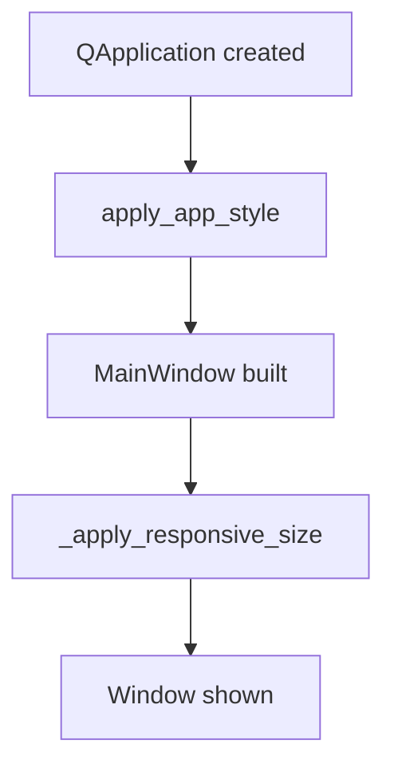

# GUI Styling

> Visual reference: [`option3.png`](option3.png).
> Scope: presentation refinement only — colors, typography, spacing, icons, and screen-aware window sizing. Widget composition, signals and intent contracts in [`gui-layout.md`](gui-layout.md) are unchanged.

## 1. Problem Description

- **Problem**: The current PySide6 shell renders correctly but uses Qt's default look, which drifts from the agreed mockup. The window also asks the screen for its size but uses hard-coded percentages and a fixed minimum, which doesn't translate well across small laptop screens or large external monitors.
- **Expected input**: A running `QApplication` constructed in `src/main.py`; the existing widget tree built by `MainWindow`.
- **Expected output**:
  - A single global QSS stylesheet applied at boot that gives the shell the mockup's palette, typography, rounded inputs, accent buttons, blue table headers, and quiet status bar.
  - A `RecordListView` whose search box has a leading magnifier icon, taller rows, and tighter spacing.
  - A `BaseFormView` whose CRUD row uses equal-width buttons with the primary "Create" action accented.
  - A `MainWindow` whose initial size, minimum size, and on-screen position are all derived from the available screen geometry.

## 2. Data Flow

The styling layer is orthogonal to the runtime data flow described in [`gui-layout.md`](gui-layout.md). It only contributes a one-shot setup step at boot:

```
QApplication.__init__
        ↓
apply_app_style(app)              (load QSS, set object names)
        ↓
MainWindow.__init__               (build widgets — they pick up the style)
        ↓
MainWindow._apply_responsive_size (size + center against screen)
```

No new runtime signals, no new modules in the canonical pipeline.

## 3. Mermaid Flow Diagram



## 4. Module Design

| Module                                | Responsibility                                                                                          | Input                  | Output                                                                                          |
| ------------------------------------- | ------------------------------------------------------------------------------------------------------- | ---------------------- | ----------------------------------------------------------------------------------------------- |
| `gui.styles`                          | Hold the consolidated QSS string and the `apply_app_style(app)` entry point. Pure presentation, no Qt widgets touched.        | `QApplication`         | `QApplication.setStyleSheet` is called with the consolidated QSS.                                |
| `gui.styles.search_icon()`            | Build a small magnifier `QIcon` from an inline SVG so we don't ship a binary asset for one glyph.       | —                      | `QIcon`                                                                                          |
| `gui.main_window.MainWindow`          | Existing responsibilities + delegate sizing/positioning to a new `_apply_responsive_size()` helper.     | screen geometry        | window resized + centered.                                                                       |
| `gui.record_list.view.RecordListView` | Add the search icon as a `QLineEdit.addAction` leading icon, set table row heights, and adjust spacing. | unchanged              | unchanged public API.                                                                            |
| `gui.common.base_form_view.BaseFormView` | Right-align labels, add row spacing, equalise CRUD button widths, mark "Create" as primary via object name. | unchanged           | unchanged public API.                                                                            |
| `gui.status_bar.view.StatusBarView`   | Show a friendly relative path (project root + below) instead of the absolute path.                      | `Path`                 | unchanged public API.                                                                            |

## 4.1 Color and typography decisions

| Token            | Value     | Used for                                                             |
| ---------------- | --------- | -------------------------------------------------------------------- |
| `bg-app`         | `#ECEEF1` | window background, status bar, inactive tabs                          |
| `bg-panel`       | `#FFFFFF` | group boxes, table, line edits, active tab                            |
| `border-soft`    | `#D8DBE0` | panel and input borders, table grid                                   |
| `text-primary`   | `#1F2933` | body text                                                             |
| `text-secondary` | `#52606D` | inactive tab labels, status bar labels                                |
| `accent`         | `#3D8BFD` | focus rings, primary button background                                |
| `accent-soft`    | `#E6EEF7` | table header background                                               |
| `selection`      | `#C8DBF7` | row/text selection                                                    |

Font stack: `"Segoe UI", "SF Pro Text", "Helvetica Neue", Arial, sans-serif` at 11pt body, 12pt group titles.

Corner radius: 4px on inputs/buttons, 8px on group boxes.

## 4.2 Responsive sizing rule

```
available  = screen.availableGeometry()
width      = clamp(available.width  * 0.85, min=960,  max=1600)
height     = clamp(available.height * 0.80, min=620,  max=1000)
min_width  = min(960,  available.width  - 40)
min_height = min(620,  available.height - 40)
```

The minimum is clamped against the actual available area so the window can still open on small laptop screens. The window is centered inside `availableGeometry()` after sizing.

## 5. Edge Cases

- **No screen reachable** (`self.screen()` returns `None`): fall back to `QApplication.primaryScreen()`. If that is also `None`, fall back to a fixed 1200×720 with no centering.
- **Small screens** (e.g. 1280×720): the clamp keeps the minimum reachable; the percentage sizing produces a smaller window than the ideal min, which is correct — user resize is still bounded by the screen-clamped minimum.
- **High-DPI screens**: Qt scales pixel sizes via the platform; the percentage-based geometry remains correct because `availableGeometry()` returns logical pixels.
- **Stylesheet missing fonts**: Qt falls back to the next family in the stack; the layout doesn't depend on a specific glyph width.
- **Inline SVG icon failing to render**: `QIcon` from an empty/invalid SVG returns an empty icon; the search box remains usable, just unadorned.

## 6. Error Handling Strategy

- **Detection**: only Qt-level failures (e.g. screen lookup) are possible. None of them raise; they return `None` or empty objects.
- **Propagation**: every fallback path is explicit (`screen or QApplication.primaryScreen() or None`); we never swallow exceptions from style application — Qt logs invalid QSS on stderr and continues.
- **User feedback**: visual only. The status bar's right cell now shows the data file path relative to the project root when possible, and falls back to the absolute path otherwise.

## 7. File Map

| File                                      | Change                                                                                  |
| ----------------------------------------- | --------------------------------------------------------------------------------------- |
| `src/gui/styles.py`                       | new — consolidated QSS string, `apply_app_style`, `search_icon`.                         |
| `src/main.py`                             | call `apply_app_style(app)` after `QApplication` construction.                           |
| `src/gui/main_window.py`                  | extract `_apply_responsive_size()`, center the window, shorten status bar path.          |
| `src/gui/record_list/view.py`             | leading search icon, row height, spacing tweaks, primary button object name on `Search`. |
| `src/gui/common/base_form_view.py`        | label alignment, row spacing, equal-width buttons, primary object name on `Create`.      |
| `src/gui/status_bar/view.py`              | render relative data-file path when the file is under the project root.                  |

Hard limits per the global rules apply: each file ≤ 300 lines, each function ≤ 30 lines, ≤ 3 parameters per function, ≤ 3 levels of nesting.