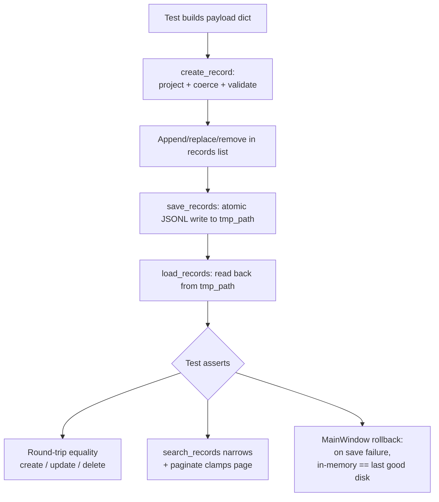

# Integration tests

Design doc for the lightweight integration test layer that lives under `tests/integration/`. Covers the §15.2 sections (problem, data flow, mermaid diagram, module design, edge cases, error handling) and explains the boundary between unit tests and these tests so future contributors know where to put new ones.

Companion to the per-feature design docs ([`create-record.md`](create-record.md), [`update-record.md`](update-record.md), [`delete-record.md`](delete-record.md)). Those describe what each flow *does*; this doc describes how we verify the flows actually fit together once the layers are composed.

---

## What it does

`tests/unit/` exercises one module at a time. `tests/integration/` exercises two or more modules wired together, against a real on-disk JSONL file in `tmp_path` — no mocks of the repository, no mocks of search, no mocks of pagination. The point is to catch breakages that only show up at the seam between layers (for example, a record dict that round-trips through `service.create_record` but is then serialised in a way that `repository.load_records` can't read back).

These tests stay CI-friendly: pure Python where possible, and where the GUI orchestrator is the only place a behaviour exists (the save-failure rollback in `MainWindow`), we drive `MainWindow` with the same offscreen-Qt pattern the existing unit tests use. No full end-to-end GUI automation, no event-loop pumping, no screenshot diffing.

---

## Problem description

- **Problem**: unit tests can pass even when the composition is wrong. A record that `service.create_record` returns can fail to round-trip through JSONL if a field type changes; `search_records` can narrow a list to fewer rows than the current page index, and we need pagination to clamp; a save failure must roll back in-memory state so the next save doesn't write a record that disk never saw. None of these are visible from a single-module unit test.
- **Expected input**: tests run via `pytest` from the repo root, with `tmp_path` providing an isolated JSONL file per test. No real `src/data/record.jsonl` is touched.
- **Expected output**: green pytest run in the existing GitHub Actions workflow (`.github/workflows/test.yml`), with `tests/integration/` collected alongside `tests/unit/`.

---

## Data Flow

These tests follow the same canonical pipeline as the production code — **Reader → Parser → Validator → Service → Repository** — but compose multiple steps in a single test so the seams are exercised:

```
test fixture        → Reader     (builds payload dicts)
record.service      → Parser + Validator + Service
record.repository   → Repository (real JSONL write/read against tmp_path)
shared.pagination   → post-Repository projection (for the search+pagination test)
gui.main_window     → Orchestrator (only in the save-failure test)
```

Mapped to the actual code:

```
_payload() helpers in test files     → Reader     (dict[str, str])
record.service.create_record         → Parser + Validator + Service
record.repository.save_records       → Repository (atomic JSONL write to tmp_path)
record.repository.load_records       → Repository (read back from tmp_path)
record.service.search_records        → post-load filter
shared.utils.pagination.paginate     → page projection over filtered rows
gui.main_window.MainWindow           → orchestrator under test (save-failure only)
```

No layer is mocked. The only monkeypatch in the suite is `gui.main_window.save_records` in the save-failure test, where the whole point is to simulate an `OSError` from the repository.

---

## Mermaid Flow Diagram



---

## Module Design

Each file under `tests/integration/` owns one concern. Helpers stay local to the file — no shared test fixtures package, because copying a five-line `_client_payload()` is cheaper than the cognitive cost of cross-file fixtures.

### `tests/integration/test_record_workflows.py`

- **Responsibility**: verify create / update / delete round-trip through `service` + `repository` without going through the GUI.
- **Input**: per-test `tmp_path / "records.jsonl"`.
- **Output**: assertions that the on-disk JSONL matches the expected list after each workflow.
- **Touches**: `record.service.create_record`, `record.repository.save_records`, `record.repository.load_records`.

### `tests/integration/test_search_pagination.py`

- **Responsibility**: verify that `search_records` and `paginate` compose correctly — the search filter narrows the row set, and the page index clamps to the new total when the filtered count shrinks.
- **Input**: a list of records seeded via `create_record` + `save_records`, then reloaded.
- **Output**: assertions on `Page.rows`, `Page.total_pages`, and `Page.current_page` for representative search + page-index combinations.
- **Touches**: `record.service.search_records`, `shared.utils.pagination.paginate`, plus the same service + repository pair to seed.

### `tests/integration/test_save_failure_consistency.py`

- **Responsibility**: verify that when `save_records` raises `OSError`, `MainWindow._records` does not move ahead of the on-disk file. Covers the update and delete paths (the create path is already covered by the existing unit test).
- **Input**: a `MainWindow` constructed against `tmp_path` with `save_records` monkeypatched to raise after the first successful save.
- **Output**: assertions that `MainWindow._records` equals `load_records(tmp_path / "record.jsonl")` after the failure — i.e. the in-memory list is consistent with disk.
- **Touches**: `gui.main_window.MainWindow`, `record.repository.load_records`, `record.service.create_record`.

---

## Edge Cases

- **Empty store on reload**: `load_records` on a never-created file returns `[]`; the create test starts from this state and asserts the first save produces a one-record file.
- **Search with empty query**: returns all rows of the requested type; pagination still applies, so a small store fits on page 1 with `total_pages == 1`.
- **Search that filters down to zero matches**: `Page.rows == []`, `Page.total_pages == 1`, `Page.current_page == 1`. `paginate` is the place that clamps; the test pins this behaviour at the integration level.
- **Page index past the new total after a search**: e.g. records 16–30 visible on page 2; a search that leaves only one match must clamp the requested page 2 back down to page 1.
- **Save failure on update**: `MainWindow._records` keeps the *old* list (the new list is only assigned after `save_records` succeeds — see `_on_update` in `src/gui/main_window.py`). Disk also keeps the prior contents because `save_records` writes to a `.tmp` sibling and `os.replace`s it atomically; a raise mid-write never overwrites the target.
- **Save failure on delete**: same shape as update — `self._records` is not reassigned, so a subsequent successful save would write the original list, not the would-be-shorter one.

---

## Error Handling Strategy

- **Where detected**: integration tests rely on the same `RecordValidationError` surface as unit tests — invalid payloads raise from `create_record`. Repository I/O errors raise `OSError` (the production rollback paths catch this; the integration test asserts the catch happened by inspecting state, not by catching exceptions in the test body).
- **How propagated**: validation errors propagate out of `create_record` to the test, which uses `pytest.raises`. `OSError` from the monkeypatched `save_records` is caught inside `MainWindow._on_update` / `_on_delete` and surfaced via the status bar; the test asserts on resulting state, not on the swallowed exception.
- **How handled**: failure-path tests assert that `MainWindow._records == load_records(...)` — the equality check is the explicit verification that the orchestrator's rollback held.

---

## Where this fits next to the unit suite

| Concern                                         | Lives in                                       |
| ----------------------------------------------- | ---------------------------------------------- |
| One module's behaviour in isolation             | `tests/unit/<package>/test_<module>.py`        |
| Two or more modules wired together              | `tests/integration/test_<workflow>.py`         |
| Full GUI scripted by a user driver              | `tests/e2e/` (reserved; not in use yet)        |

If a new test only needs `record.service` *or* `record.repository`, it belongs in `tests/unit/record/`. If it needs both — or service + pagination, or MainWindow + repository — it belongs here.

---

## Running the tests

```bash
pip install -r requirements.txt
pytest                            # whole suite
pytest tests/integration -q       # integration only
```

CI runs the full suite via `.github/workflows/test.yml` with `QT_QPA_PLATFORM=offscreen` and the Qt runtime libraries pre-installed, so the MainWindow-driven test in `test_save_failure_consistency.py` runs on the Ubuntu runner without a display.
