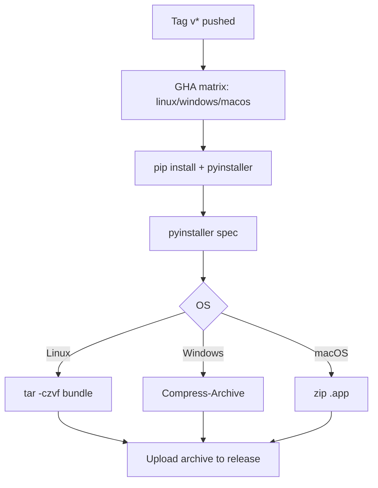

# Packaging & Release

> Scope: turn the source tree into platform-native, downloadable artifacts (`.app` on macOS, `.exe` folder on Windows, tarred folder on Linux) and publish them to GitHub Releases on every version tag.

## 1. Problem Description

- **Problem**: The brief requires a packaged deliverable built with PyInstaller 6.6.0. Today the app only runs from source. A grader (or any teammate) on Windows or Linux has no way to download a working build.
- **Expected input**:
  - A push of an annotated tag matching `v*` (e.g. `v0.1.0`), or a manual dispatch from the GitHub Actions tab.
- **Expected output**:
  - Three archives attached to a GitHub Release:
    - `RecordManagementSystem-linux-x86_64.tar.gz`
    - `RecordManagementSystem-windows-x86_64.zip`
    - `RecordManagementSystem-macos.zip`
  - Each archive contains a runnable bundle that loads `src/conf/config.json` from inside the bundle and persists records to `~/RecordManagementSystem/record.jsonl`.

## 2. Data Flow

```
git tag v0.1.0; git push --tags
         ↓
GitHub Actions matrix (ubuntu / windows / macos)
         ↓
pip install requirements.txt + pyinstaller==6.6.0
         ↓
pyinstaller RecordManagementSystem.spec   (per OS)
         ↓
tar/zip the dist/<bundle>
         ↓
softprops/action-gh-release publishes archives to the v0.1.0 release
```

At runtime inside a frozen bundle:

```
QApplication boot
         ↓
load_config()                                  (reads sys._MEIPASS/conf/config.json)
         ↓
record_file = ~/RecordManagementSystem/record.jsonl   (created on first save)
icon_path  = sys._MEIPASS/icons/favorite.png          (read-only)
```

## 3. Mermaid Flow Diagram



## 4. Module Design

| File                                  | Role                                                                                   |
| ------------------------------------- | -------------------------------------------------------------------------------------- |
| `RecordManagementSystem.spec`         | PyInstaller spec at repo root. Declares entry point, bundled `datas`, one-folder mode, macOS `.app` wrapping. |
| `src/conf/loader.py`                  | Frozen-aware path resolution: bundled assets via `sys._MEIPASS`, user-writable records via `~/RecordManagementSystem`. |
| `.github/workflows/release.yml`       | Matrix build + release upload job.                                                     |

### 4.1 Frozen-mode path rules

| Asset           | Source mode (running `python src/main.py`)         | Frozen mode (PyInstaller bundle)                                |
| --------------- | -------------------------------------------------- | -------------------------------------------------------------- |
| `config.json`   | `src/conf/config.json`                             | `sys._MEIPASS/conf/config.json`                                 |
| `favorite.png`  | `src/icons/favorite.png`                           | `sys._MEIPASS/icons/favorite.png`                               |
| `record.jsonl`  | `src/data/record.jsonl`                            | `~/RecordManagementSystem/record.jsonl` (created on first save) |

The split matters because the `_MEIPASS` directory is re-extracted to a temp location on every launch — writing there would silently lose data.

### 4.2 Spec file shape (one-folder, cross-platform)

- `Analysis(["src/main.py"], pathex=["src"], datas=[...])`
- `EXE(..., exclude_binaries=True, console=False)` — windowed launcher
- `COLLECT(...)` — produces `dist/RecordManagementSystem/` on Win/Linux
- `if sys.platform == "darwin": BUNDLE(...)` — wraps `dist/RecordManagementSystem.app`

Icons: the spec leaves `icon=None` for now (PyInstaller default). Adding `.ico`/`.icns` is a future polish — the window icon (`favorite.png` via `QApplication.setWindowIcon`) still renders at runtime in all cases.

### 4.3 Release workflow shape

- Trigger: `push` of `v*` tag or manual `workflow_dispatch`.
- `build` job: matrix over `ubuntu-latest`, `windows-latest`, `macos-latest`. Each installs Python 3.11, deps, PyInstaller 6.6.0, builds the spec, archives the bundle, uploads as an artifact.
- `release` job: only runs on tag pushes. Downloads all artifacts and publishes them with `softprops/action-gh-release@v2` plus auto-generated release notes.

## 5. Edge Cases

- **Tag pushed but build fails on one OS**: `fail-fast: false` lets the other two finish; the release job runs and uploads only what succeeded. Grader still gets two of three.
- **Manual dispatch (no tag)**: builds and uploads artifacts, but skips the release job (`if: startsWith(github.ref, 'refs/tags/v')`).
- **First launch with no `record.jsonl`**: `load_records` already returns `[]` when the file is absent; the first save creates the file (loader pre-creates the parent dir).
- **Gatekeeper on macOS**: an unsigned `.app` requires right-click → Open the first time. README will note this.
- **Windows SmartScreen**: an unsigned `.exe` shows a "Windows protected your PC" prompt; click "More info" → "Run anyway". README will note this.
- **Running from source after the change**: `_FROZEN` is `False`, so paths resolve relative to `src/` exactly as today. Tests remain unaffected.

## 6. Error Handling Strategy

- **Detection**: `load_config()` still raises on missing/malformed `config.json` (fail fast — same behaviour as today).
- **Propagation**: PyInstaller errors fail the workflow step; the artifact for that OS is simply not produced.
- **User feedback**: GitHub Actions surfaces failures inline on the workflow run; no in-app feedback path is needed since these are build-time errors.

## 7. File Map

| File                                          | Change                                                                    |
| --------------------------------------------- | ------------------------------------------------------------------------- |
| `docs/design/packaging-and-release.md`        | new — this document.                                                      |
| `src/conf/loader.py`                          | frozen-aware path resolution; new `_resolve_record_file` for user data.   |
| `RecordManagementSystem.spec`                 | new — PyInstaller spec at repo root.                                       |
| `.github/workflows/release.yml`               | new — matrix build + GH Release upload.                                    |
| `README.md`                                   | brief "Download" + "Release flow" sections linking to this doc.            |
