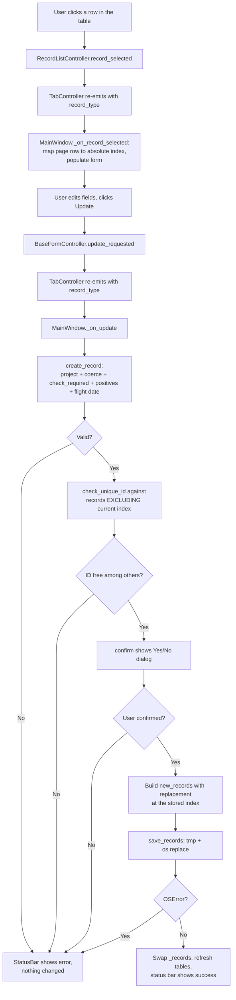

# How updating a record works

Design doc and tour for the update-record flow. Covers the §15.2 sections (problem, data flow, mermaid diagram, module design, edge cases, error handling) and a walkthrough for teammates picking up the code.

Companion to [`create-record.md`](create-record.md) — read that first if you haven't, because update reuses the create pipeline for validation.

---

## What it does

Click a row in the record table on the right → the form on the left fills with that record's values → edit any field → click **Update**:

1. the edited fields are checked for missing data and bad input,
2. the new `ID` is rejected if it clashes with another record of the same type,
3. the in-memory list has the old record replaced by the new one at the same index,
4. the JSONL file is rewritten atomically,
5. the table on the right refreshes.

If anything fails, the status bar shows why and the in-memory list + file stay untouched. If the user clicks Update without first selecting a row, the status bar says so and nothing else happens.

---

## Problem description

- **Problem**: users need to fix mistakes in stored records (typos, changed addresses, rescheduled flights). Without update, they would have to delete + re-create, which is awkward and risks data loss between the two steps.
- **Expected input**: a row selection in the visible table plus an edited form payload (`dict[str, str]` of field → widget value).
- **Expected output**: the targeted record in `record.jsonl` is replaced by the new validated record; all other records are untouched; the table reflects the change. On validation/persistence failure: no changes anywhere, error message in the status bar.

---

## Data Flow

Same canonical CLAUDE.md §9 shape as create — **Reader → Parser → Validator → Service → Repository** — with one additional reader step at the front: a row-selection signal that tells the orchestrator *which* record to update.

Mapped to the actual code:

```
RecordListView.cellClicked            → Reader     (row click → row index)
MainWindow._on_record_selected        → Reader     (row index → absolute records index + form.populate)
BaseFormView.read_payload             → Reader     (widget state → dict[str, str])
_project_payload + _coerce_integers   → Parser     (dict[str, str] → typed record dict)
check_required + check_*              → Validator  (raises RecordValidationError)
check_unique_id against OTHERS        → Validator  (uniqueness, excluding the record being updated)
create_record                         → Service    (reused; builds the new validated record)
gui.common.dialogs.confirm            → Confirmer  (modal Yes/No before overwriting)
save_records                          → Repository (atomic JSONL write of the replaced list)
```

`create_record` is reused intentionally: the rule for "what is a valid record" doesn't change between create and update — only the persistence pattern does (append vs replace).

---

## Mermaid Flow Diagram



---

## Module Design

The dependency arrow still points one way — GUI → record, never the reverse — and `record.*` has zero `from gui.*` imports.

### GUI side (Reader + glue)

| Module | Responsibility | Input | Output |
| --- | --- | --- | --- |
| `gui.record_list.RecordListView` | Hold the table widget; expose the currently selected row via `current_row()`. | user click on a table row | `int` row index or `-1` |
| `gui.record_list.RecordListController` | Watch `itemSelectionChanged`; on a real selection emit `record_selected(row_index)`. | Qt selection signal | `record_selected(int)` Qt signal |
| `gui.tab.TabController` | Tag the row-selection with this tab's `record_type` and re-emit. | `record_selected(int)` | `record_selected(str, int)` Qt signal |
| `gui.common.BaseFormView.populate` | Set every form widget's value from a record dict (line edit → `setText`, combo → `setCurrentIndex(findText(value))`). | `record: dict` | side-effect on widgets |
| `gui.main_window.MainWindow._on_record_selected` | Resolve the page row to the absolute `_records` index; store it per record-type; call `form.populate(record)`. | `record_type: str`, `row_index: int` | side-effects: stored selection, populated form |
| `gui.main_window.MainWindow._on_update` | Orchestrator: validate → uniqueness-excluding-self → confirm → replace → save → refresh → status. | `record_type: str`, `payload: dict` | side-effects: in-memory state, file, table, status message |
| `gui.common.dialogs.confirm` | Modal Yes/No before overwriting. Defaults to **No** so accidental Enter never commits an edit. Shared with `_on_delete` and `_on_clear_all`. | `parent: QWidget`, `title: str`, `body: str` | `bool` (True = user confirmed) |

### Data side (Parser + Validator + Service + Repository) — reused unchanged

| Module | Responsibility |
| --- | --- |
| `record.service.create_record` | Build a validated record from a payload (project allowed fields, coerce ID strings to int, run all checkers). |
| `record.validator.check_unique_id` | For Client / Airline, raise if `ID` exists in the list passed in. The orchestrator passes records **excluding the one being updated**, so the same ID is allowed. |
| `record.repository.save_records` | Atomic JSONL write — write `record.jsonl.tmp` then `os.replace`. |

No data-layer code changes are required for this feature; the layer's contract was already update-friendly.

---

## Edge Cases

| Case | Handling |
| --- | --- |
| User clicks **Update** without first selecting a row | Status bar: `"Select a record to update first."`; nothing else changes. |
| Stored selection points past the end of `_records` (e.g. records changed elsewhere) | Treated as no selection — same message as above. |
| User clicks **Update**, validation passes, then declines the confirmation dialog | Status bar: `"Update cancelled."`; no save, no in-memory change. |
| User changes a required field to empty | `check_required` raises; status bar shows it; file untouched. |
| User changes `Country` back to the `"-- select --"` placeholder | Treated as empty → `Country is required.` |
| User changes `ID` to a value already used by **another** record of the same type | `check_unique_id` raises `<Type> ID <n> already exists.` |
| User leaves `ID` unchanged (or changes it to a value only the current record holds) | Allowed — the current record is excluded from the uniqueness scan. |
| User edits a Flight row | No own-`ID` uniqueness rule for flights, so `check_unique_id` is a no-op as designed; the other validators still run. |
| Payload contains stale or unknown fields | Silently dropped by `_project_payload`; only canonical fields are persisted. |
| Disk-write failure during `save_records` (`OSError` / `PermissionError`) | The in-memory `_records` is **not** swapped in; the on-disk file is whatever `os.replace` last committed. Status bar shows `"Save failed: …"`. |
| User selects a row, then changes the search/page so the selected record is no longer on screen | Index is still valid — update operates on the absolute index, not the visible row. The table refresh after a successful update may move the record to a different page; that's fine. |

---

## Error Handling Strategy

- **Where errors are detected**:
  - validation errors (`RecordValidationError`) raised by `create_record` (projection/coercion/required/positives/flight date) and by `check_unique_id`.
  - persistence errors (`OSError`, including `PermissionError`) raised by `save_records`.
  - missing or stale selection caught explicitly in `_on_update` before any data-layer call.
- **How they are propagated**:
  - the data layer raises; it never logs, never returns error codes, never silently corrects.
  - the orchestrator (`MainWindow._on_update`) is the only place that catches them.
- **How they are handled**:
  - validation failure → status bar shows the message; the in-memory list and file are left exactly as they were.
  - persistence failure → status bar shows `"Save failed: <reason>"`. Crucially, we **build the new list as a separate object** (`new_records = list(self._records); new_records[idx] = record`) and only swap `self._records = new_records` **after** the save succeeds. That's the update-equivalent of the create-flow rollback in [`create-record.md`](create-record.md#error-handling-strategy): in-memory state never moves ahead of disk state.
  - missing selection → status bar shows the prompt; the function returns before touching anything.
- **What is NOT handled today** (known gaps):
  - Concurrent edits from another process aren't considered — single-user desktop tool.
  - If the user has scrolled to a different page when an update succeeds, the table refresh keeps them on their current page; the edited record may land elsewhere. Acceptable for the assignment scope; revisit if it bites.

---

## Why this shape

- **Replace by absolute index, not by ID lookup.** The user's selection is a row, not an ID. Storing the absolute index in `_records` makes the operation O(1) and lets us update Flight records (which have no own ID) the same way as Client/Airline records.
- **Uniqueness check excludes the current record.** If we passed the full list to `check_unique_id`, an update that doesn't touch `ID` would always fail. Passing `records[:idx] + records[idx+1:]` keeps the existing validator API untouched and expresses the intent at the call-site.
- **Build new list, then swap.** Mirrors the create-flow's rollback discipline: in-memory state is only mutated **after** persistence succeeds, so a disk failure can never leave the GUI and the file out of sync.
- **`create_record` reused.** The validation pipeline for "is this a valid record?" is identical for create and update. Renaming or duplicating it would only add surface area; the orchestrator's step comment names the intent.
- **Selection is per record-type.** Each tab has its own table, so each tab tracks its own selected index. Switching tabs doesn't clear other tabs' selections.

---

## What happens when you click Update

```
1. User clicks a row in the Client tab's RecordListView
       ↓ (Qt's QTableWidget.cellClicked signal — fires on every click,
          even re-clicking the same row, so a row-0 click after a
          delete still propagates)
2. RecordListController emits record_selected(row_index)
       ↓
3. TabController re-emits record_selected("Client", row_index)
       ↓
4. MainWindow._on_record_selected("Client", row_index):
       a. compute the absolute index in self._records
       b. self._selected_index_by_type["Client"] = absolute_index
       c. tab.view.form.populate(self._records[absolute_index])
       ↓
5. User edits fields and clicks [Update] in ClientFormView
       ↓
6. BaseFormController emits update_requested(payload)
       ↓
7. TabController re-emits update_requested("Client", payload)
       ↓
8. MainWindow._on_update("Client", payload):
       a. idx = self._selected_index_by_type.get("Client")
          → if None or out of range: status "Select a record to update first.", return
       b. record = create_record("Client", payload)              ← validate + build
       c. check_unique_id(record, _records WITHOUT idx)          ← uniqueness vs others
       d. new_records = list(_records); new_records[idx] = record
       e. save_records(DATA_FILE_PATH, new_records)              ← atomic write
       f. self._records = new_records                            ← only AFTER save succeeds
       g. self._refresh_all_tables()
       h. status bar: "Update Client {...}"
```

If 8b or 8c raises `RecordValidationError`, the orchestrator catches it, shows the message, and skips 8d–8h. If 8e raises `OSError`, the orchestrator catches it, shows `"Save failed: …"`, and skips 8f–8h — `self._records` is never reassigned, so the in-memory list stays consistent with the on-disk file.

---

## Where to look when you want to change something

| To change | Edit |
| --- | --- |
| What happens when the user clicks a table row | `src/gui/record_list/controller.py` (selection signal) and `src/gui/main_window.py` (`_on_record_selected`) |
| How a record is loaded back into the form | `src/gui/common/base_form_view.py` (`populate`) |
| The validation rules applied on update | `src/record/validator.py` (shared with create) |
| The error message shown for missing selection | `src/gui/main_window.py` (`_on_update`, the early-return branch) |
| Whether ID changes are allowed | currently allowed; restrict by adding a check in `_on_update` before calling `create_record` |

---

## Suggested first read

Open `src/gui/main_window.py` and read `_on_record_selected` then `_on_update`, top to bottom. Six steps in each; together they're the entire feature. Everything else is plumbing that pre-existed for create.