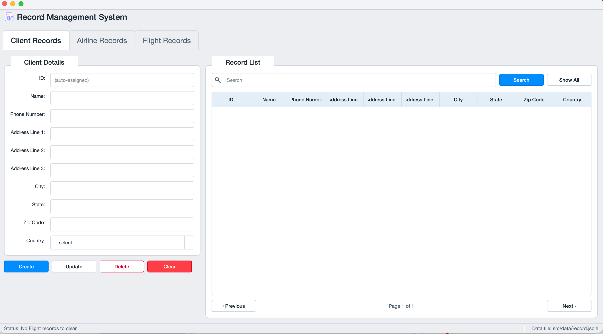
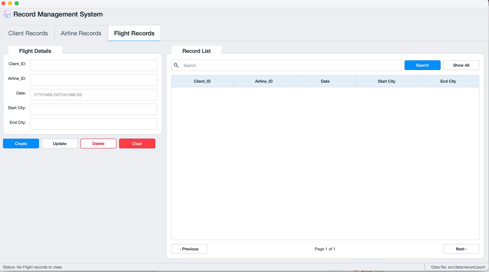
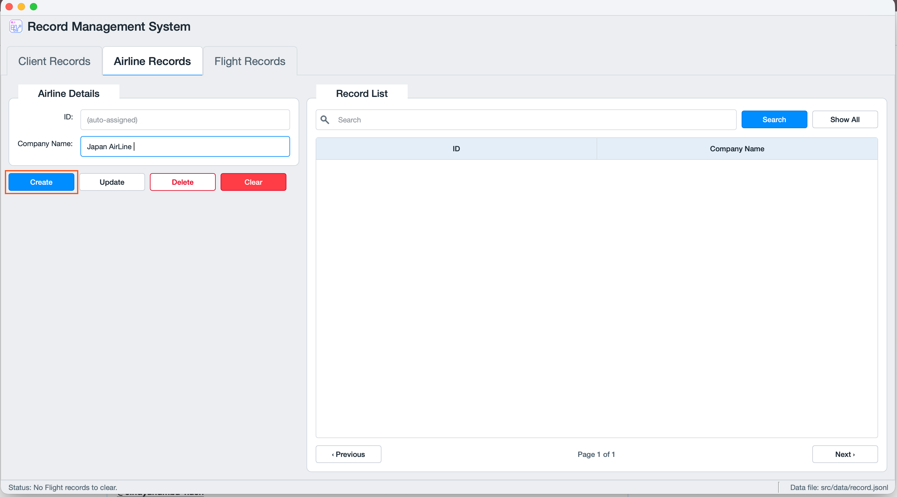
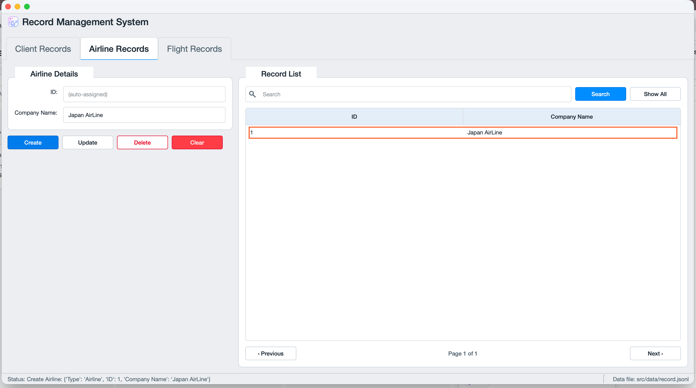
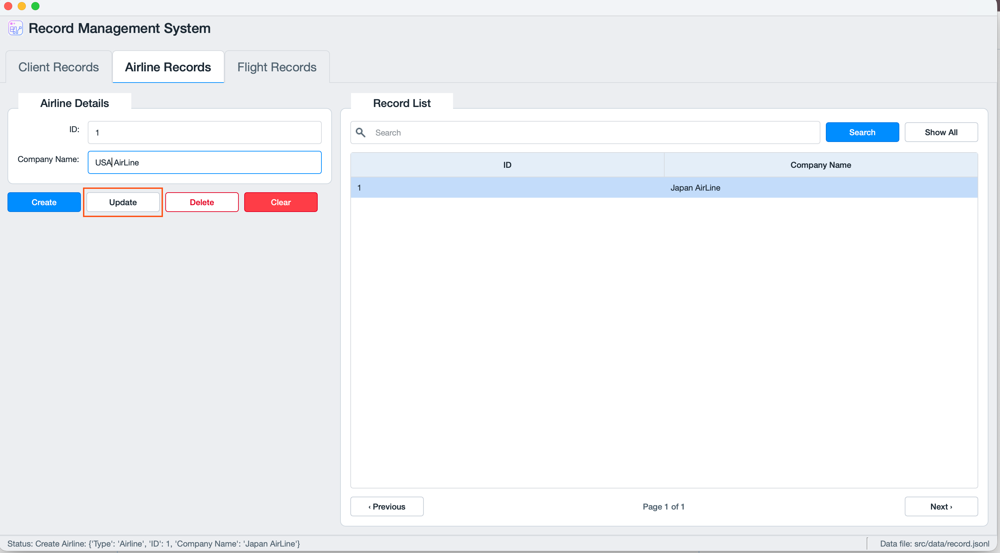
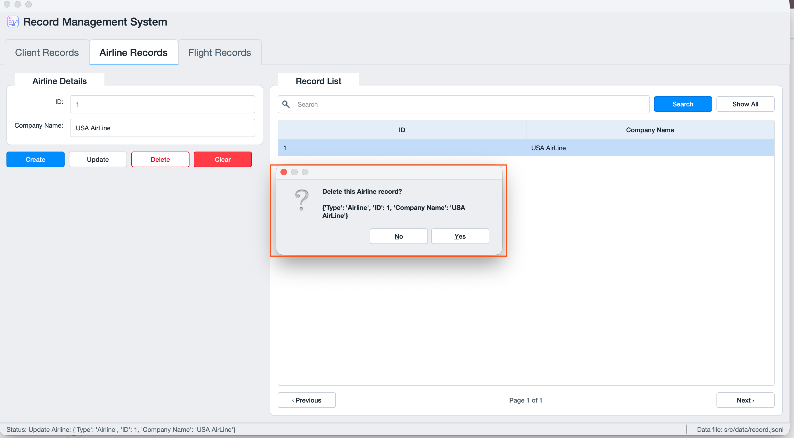
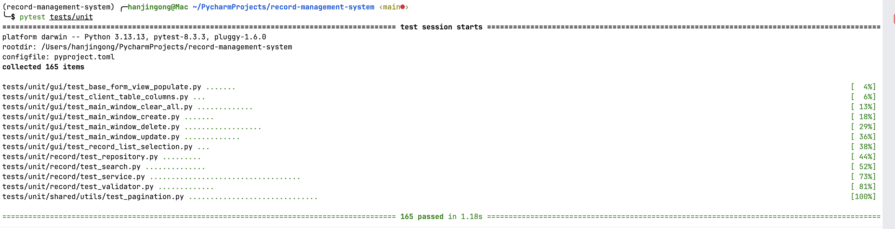
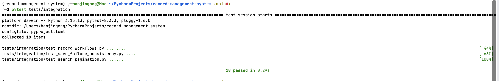
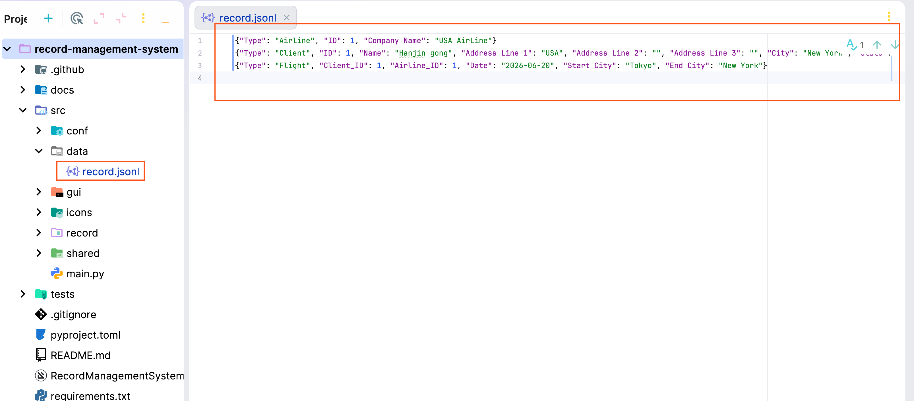

# Project Screenshots

## Client Records Interface

## Airline Records Interface

## Flight Records Interface

## Create Record Workflow

## Search Results

## Update Record Workflow

## Delete Confirmation

## Unit Testing

## Integration Testing

## Data Storage Example

